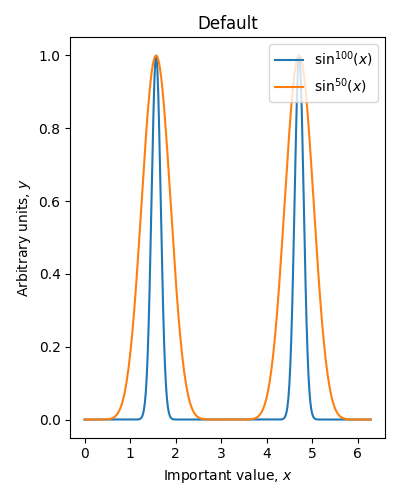
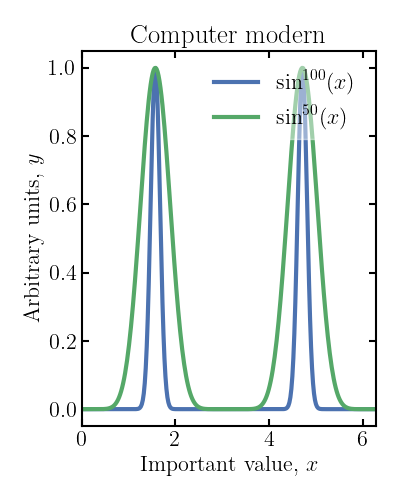

# plt-styles-phys
Publication ready plots in python (physics)

Can be loaded as simplte as
- Computer modern style

```python
plt.rcdefaults()  # reset to default
plt.style.use('https://raw.githubusercontent.com/toftul/plt-styles-phys/main/phys-plots-cm.mplstyle')
```

- Improved sans style

```python
plt.rcdefaults()  # reset to default
plt.style.use('https://raw.githubusercontent.com/toftul/plt-styles-phys/main/phys-plots-sans.mplstyle')
```

Or you are free to download these style files, change and use as
```python
plt.style.use('<FILENAME>.mplstyle')
```
More to look at:
- https://matplotlib.org/stable/tutorials/introductory/customizing.html
- https://github.com/venkatesannaveen/python-science-tutorial


## Examples

### Default
```python
plt.rcdefaults()
```


### Computer moder font (default $\LaTeX$ font)
```python
plt.rcdefaults()  # reset to default
plt.style.use('https://raw.githubusercontent.com/toftul/plt-styles-phys/main/phys-plots-cm.mplstyle')
```


### Good sans font (ideal for presentations)
```python
plt.rcdefaults()  # reset to default
plt.style.use('https://raw.githubusercontent.com/toftul/plt-styles-phys/main/phys-plots-sans.mplstyle')
```

