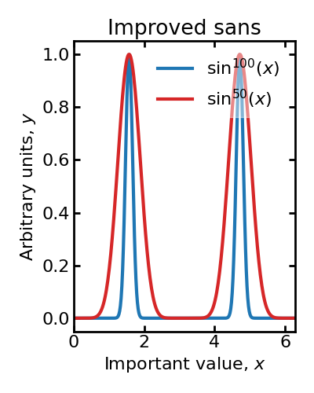

# plt-styles-pro
Publication ready plots in python (physics)

Can be loaded as simplte as
- Computer modern style

```python
plt.style.use('https://raw.githubusercontent.com/toftul/plt-styles-phys/main/phys-plots-cm.mplstyle')
```

- Improved sans style

```python
plt.style.use('https://raw.githubusercontent.com/toftul/plt-styles-phys/main/phys-plots-sans.mplstyle')
```

Or you are free to download these style files, change and use as
```python
plt.style.use('<FILENAME>.mplstyle')
```

## Examples


